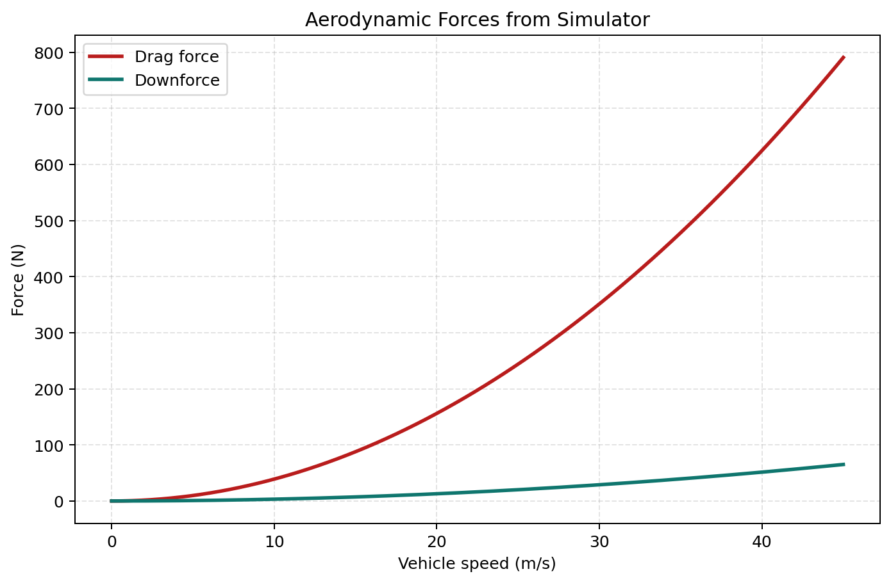
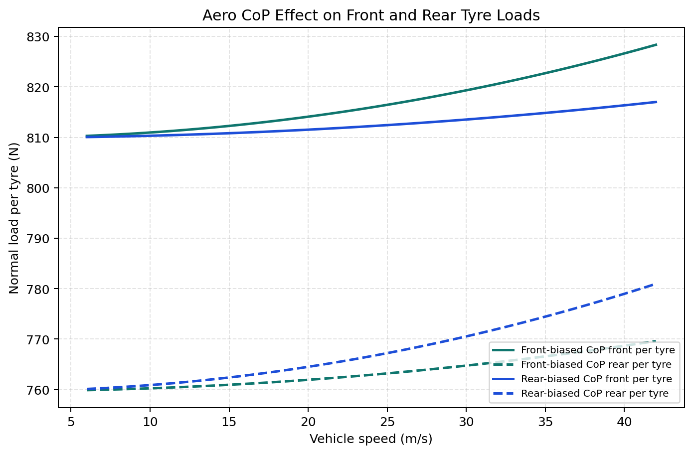
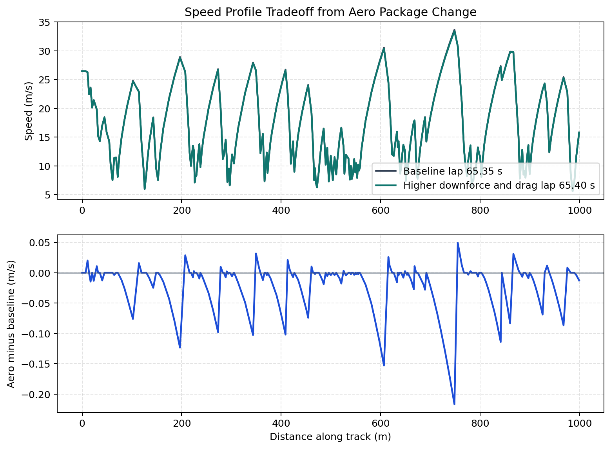

# Aerodynamics Model Intro

## Read this after
Read [Powertrain Model and Wheel Force Flow](Powertrain-Model.md) first.

## Audience
This note is for readers who already know the basic simulator flow.

## Goal
By the end, you should know

- what drag and downforce do in this simulator
- why aerodynamic forces grow strongly with speed
- how aero center of pressure changes front and rear tyre loads
- how aero changes lap speed as a tradeoff

## One minute mental model
Aerodynamics does two jobs.

- Drag resists motion and hurts acceleration and top speed.
- Downforce adds vertical load and can increase available tyre force.

Simple analogy

- drag is like wind pushing back on your hand out of a car window
- downforce is like pressing the car harder into the road

## Drag and downforce in this simulator
The vehicle model computes both with speed squared relations.

$$
F_{drag} = \tfrac{1}{2}\rho C_d A v^2
$$

$$
F_{down} = \tfrac{1}{2}\rho C_L A v^2
$$

Implementation path

- [src/vehicle/vehicle.py](../../src/vehicle/vehicle.py)

Simulator output example

Script path [tools/analysis/generate_aero_intro_figures.py](../../tools/analysis/generate_aero_intro_figures.py)

Inputs

- Air density rho = 1.225 kg/m^3
- Frontal area A = 0.75 m^2
- Drag coefficient Cd = 0.850
- Downforce coefficient Cl = 0.070
- Speed sweep = 0 to 45 m/s

Results

- At 30 m/s, Drag = 351.42 N
- At 30 m/s, Downforce = 28.94 N
- At 30 m/s, Drag/Downforce = 12.14

In this baseline setup, drag is larger than downforce over most of the range.
That means aero can easily become a straight-line penalty if downforce gain is modest.

## Aero center of pressure and axle load split
Total downforce is only one part of the story.
Where that downforce acts also matters.

`aero_cp` controls this location along wheelbase.
The solver splits total aero load between front and rear axles from static equilibrium.

Simple analogy

Think of a seesaw.
Move the push point and front and rear support reactions change.

Simulator output example

Script path [tools/analysis/generate_aero_intro_figures.py](../../tools/analysis/generate_aero_intro_figures.py)

Inputs

- Wheelbase L = 1.60 m
- Front-biased CoP = 0.56 m
- Rear-biased CoP = 1.20 m
- Speed sweep = 6 to 42 m/s

Results

- At 30 m/s front-biased F/R = 819.3/764.8 N
- At 30 m/s rear-biased F/R = 813.5/770.5 N
- Front-load shift at 30 m/s = -5.8 N

Solid lines are front per-tyre loads.
Dashed lines are rear per-tyre loads.

Implementation path

- [src/simulator/util/calcSpeedProfile.py](../../src/simulator/util/calcSpeedProfile.py)

Related parameter deep-dive

- [Aero CoP Deep Dive](../parameters/Aero-CoP-Deep-Dive.md)

## How aero couples with tyre and powertrain
Aero is coupled with both previous lessons.

1. Powertrain requests longitudinal force.
2. Drag subtracts from available net longitudinal force.
3. Downforce changes tyre normal loads.
4. Tyre model then changes available force limits based on those loads.

So aero can help in corners and hurt on straights at the same time.

## Speed profile tradeoff example
This comparison uses the live simulator with

- baseline aero package
- modified package with higher downforce and higher drag

Top panel shows speed profile.
Bottom panel shows pointwise speed difference.

Script path [tools/analysis/generate_aero_intro_figures.py](../../tools/analysis/generate_aero_intro_figures.py)

Inputs

- Track = datasets/tracks/FSUK.txt
- Baseline Cd/Cl = 0.850/0.0700
- Modified Cd multiplier = 1.18
- Modified Cl multiplier = 1.45

Results

- Modified Cd/Cl = 1.003/0.1015
- Lap times = 65.353 s to 65.403 s
- Lap delta = +0.050 s
- At 30 m/s Drag delta = +63.26 N
- At 30 m/s Downforce delta = +13.02 N
- Faster/slower/equal points = 26/141/91
- Delta-speed min/max = -0.217/+0.049 m/s

In this run, the higher-downforce package is slightly slower overall.
This is a good reminder that aero setup is always a tradeoff problem.

## Known limits in this intro
This page keeps the aero story simple.
It does not cover full ride-height aero maps or transient aero effects.

## Related lessons
- [Simulator Basics](Simulator-Basics.md)
- [Tyre Model Intro](Tyre-Model.md)
- [Powertrain Model and Wheel Force Flow](Powertrain-Model.md)
- [Lessons Index](README.md)