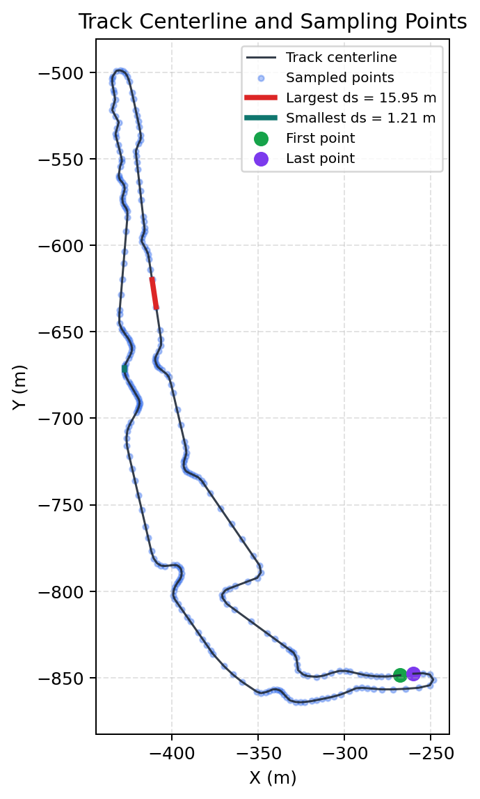
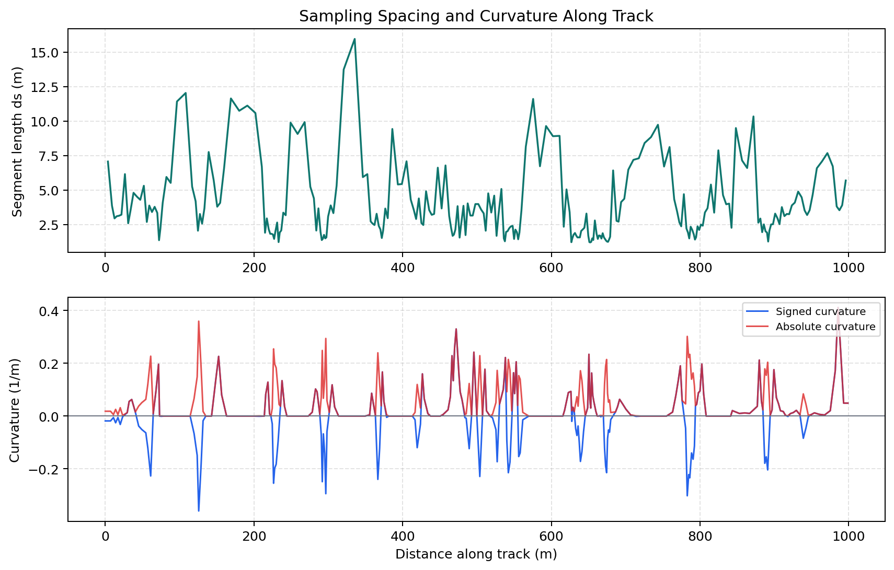
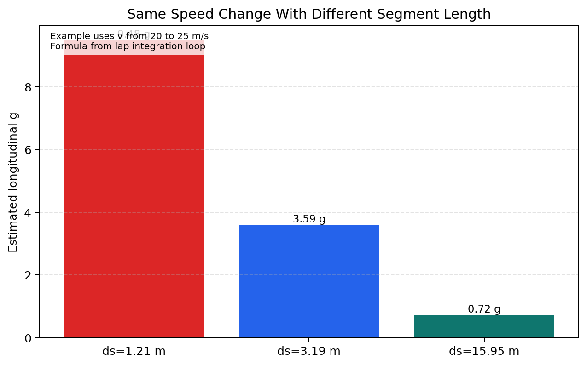

# Track Geometry and Sampling for Vehicle Dynamics

## Read this after
Read [Simulator Basics](Simulator-Basics.md) first.

## Goal
By the end, you should know

- how the simulator converts a track file into VD inputs
- why point spacing affects curvature and acceleration channels
- what quick checks to run before trusting lap deltas

## When to worry about sampling quality
Use this as a quick screen before setup A B comparisons.
These are red flags, not automatic fail gates.

- Red flag 1 spacing spread is large: `max(ds) > 5 x median(ds)`
- Red flag 2 closure gap is large for a closed track: `gap(start,end) > 1%` of total track length
- Red flag 3 isolated curvature spike: one point has much larger `|kappa|` than nearby points and no matching geometric reason in the map

## One minute mental model
The simulator does not solve on a perfectly smooth curve.
It solves on a list of sampled points.

Each point stores

- distance along track
- curvature
- heading
- elevation angle

So track geometry quality and point spacing directly affect the speed profile.

## How the track file becomes VD inputs
The loader reads x y z points and computes geometric channels.

Code path

- [src/track/track.py](../../src/track/track.py) `load_track`
- [src/track/track.py](../../src/track/track.py) `_calc_cum_dist`
- [src/track/track.py](../../src/track/track.py) `_calc_curvature`
- [src/track/track.py](../../src/track/track.py) `_calc_headings`
- [src/track/track.py](../../src/track/track.py) `_calc_elevation_angles`

Current run input and geometry summary

- Track = datasets/tracks/FSUK.txt
- Point count = 258
- Total length = 998.939 m
- Closure gap between first and last listed points = 7.646 m

## Visual 1 track shape and sampled points

Script path [tools/analysis/generate_track_geometry_sampling_figures.py](../../tools/analysis/generate_track_geometry_sampling_figures.py)

What to notice

- The solver runs on sampled points, not a continuous spline
- Segment spacing is not uniform across the full lap
- First and last listed points are close but not identical

## Visual 2 spacing and curvature along distance

Current run spacing stats

- Smallest segment length ds = 1.210 m
- Median segment length ds = 3.192 m
- Largest segment length ds = 15.952 m
- Peak absolute curvature = 0.411 1/m

Why this matters

- Curvature enters the corner relation $a_y = v^2 \kappa$
- Noisy spacing can create noisy curvature estimates
- Curvature noise can move local speed limits and lap channels

## Visual 3 why segment length affects longitudinal g estimate
The lap loop computes longitudinal g using

$$
g_{long} = \frac{(v_i^2 - v_{i-1}^2)}{2\,ds\,9.81}
$$

For the same speed change, smaller `ds` gives a larger g estimate.
That is why spacing quality matters for telemetry interpretation.

Code path for integration channels

- [src/simulator/simulator.py](../../src/simulator/simulator.py) `g_long = ((v_curr**2 - v_prev**2) / (2 * ds)) / 9.81`
- [src/simulator/simulator.py](../../src/simulator/simulator.py) `g_lat = v_curr**2 * track.points[i].curvature / 9.81`
- [src/simulator/simulator.py](../../src/simulator/simulator.py) `dt = ds / v_avg`

## Quick trust checks before tuning
1. Check min median max segment length and look for extreme outliers
2. Check curvature trace for one-point spikes
3. Check if lap deltas are supported by limiter mode changes, not only one noisy area
4. Compare g channel spikes against local spacing and curvature around the same distance

## Limits of this page
This page explains geometry and sampling effects only.
It does not include full filtering or advanced track reconstruction methods.

## Related lessons
- [Simulator Basics](Simulator-Basics.md)
- [Vehicle Modelling Capstone](Vehicle-Modelling.md)
- [Vehicle Modelling Diagnostics and Trust Checks](Vehicle-Modelling-Diagnostics.md)
- [Lessons Index](README.md)
