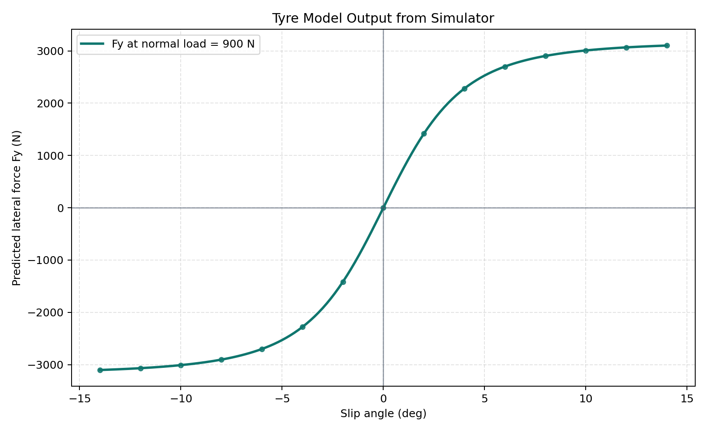
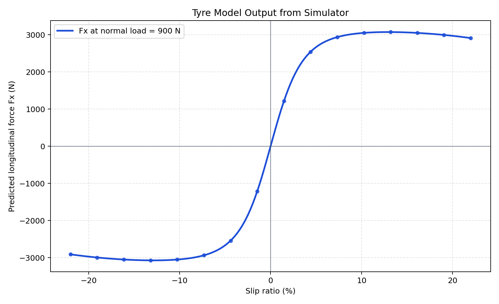

# Tyre Model Intro

## Read this after
Start with [Simulator Basics](Simulator-Basics.md).

## Audience
This note is for new readers.

## Goal
By the end, you should know

- what the tyre model is trying to represent
- what main inputs create tyre force
- where `base_mu` and `wheel_radius` fit
- how tyre force is used by the simulator

## One minute mental model
The tyre model is the grip translator.
It takes slip and normal load, then returns force at the contact patch.

Simple analogy

- powertrain asks for force
- tyre decides how much is physically possible
- the solver moves the car using that allowed force

## Two key inputs you will see everywhere

### Slip angle
Slip angle is the difference between

- where the wheel is pointing
- where the tyre is actually moving

Small slip angle usually gives small lateral force.
Larger slip angle usually gives more lateral force up to a peak, then it saturates.

This plot comes from the current simulator tyre model at fixed normal load 900 N per tyre.

### Slip ratio
Slip ratio compares wheel circumferential speed and vehicle forward speed.

- near zero means free rolling
- positive usually means drive slip
- negative usually means brake slip

As with slip angle, force grows first and then saturates.

This plot also comes from the current simulator tyre model at fixed normal load 900 N per tyre.
Script path

- [tools/analysis/generate_tyre_intro_figures.py](../../tools/analysis/generate_tyre_intro_figures.py)

## Start from real behaviour
Tyre force does not grow forever.
As slip increases, force rises, reaches a peak, then saturates.

If this is your first tyre model, use this picture

- slip is like dragging a rubber eraser across a desk
- more mismatch gives more force first
- after a point, extra mismatch gives less useful extra force

This is why tyre models are nonlinear.

## Inputs and outputs in this simulator
Main inputs

- slip angle for lateral force
- slip ratio for longitudinal force
- normal load per tyre

Main outputs

- lateral force $F_y$
- longitudinal force $F_x$
- a combined limited force pair when demand is too high

Implementation path

- [src/vehicle/Tyres/baseTyre.py](../../src/vehicle/Tyres/baseTyre.py)

## Why literature uses Pacejka style curves
The model used here follows a Pacejka style Magic Formula approach.
This is an empirical model family fit to measured tyre data.

In beginner terms

- slip tells us where we are on the curve
- load scales the force ceiling
- shape terms control how sharp the rise and saturation look

## Where base_mu fits
`base_mu` is a global tyre capability scale in this codebase.

Analogy

Think of `base_mu` as a grip volume knob for the same tyre curve family.
Turn it up and the force ceiling rises.
Turn it down and the force ceiling falls.

So

- higher `base_mu` means more available tyre force
- lower `base_mu` means less available tyre force

## Where wheel_radius fits and why loaded radius matters
`wheel_radius` belongs to kinematics and powertrain conversion.
It links wheel speed, engine speed, and torque to contact patch force.

Literature slip kinematics use effective rolling radius.
That is usually closer to loaded radius than free static geometric radius.

Analogy

Think of a basketball with a person leaning on it.
The catalog radius did not change, but rolling behaviour on the floor did change.
Tyres behave similarly under load.

That is why loaded effective radius is the healthier assumption for simulation.

## How tyre force is used in this simulator
Tyre force is one part of the full chain.

1. Powertrain requests longitudinal force.
2. Tyre model limits force based on slip and load.
3. Lateral demand consumes part of combined grip budget.
4. Drag reduces net longitudinal acceleration.
5. Corner solve uses tyre force and yaw balance.

In the forward pass

$$
F_{x,net} = \min(F_{x,power}, F_{x,tyre\_limit}) - F_{drag}
$$

Key runtime files

- [src/simulator/util/calcSpeedProfile.py](../../src/simulator/util/calcSpeedProfile.py)
- [src/simulator/util/vehicleDynamics.py](../../src/simulator/util/vehicleDynamics.py)
- [src/vehicle/vehicle.py](../../src/vehicle/vehicle.py)

## What this intro does not cover
This page stays intentionally basic.
For equations, combined slip details, and model limits, read [Tyre Model Deep Dive](Tyre-Model-Deep-Dive.md).

## Related lessons
- [Simulator Basics](Simulator-Basics.md)
- [Tyre Model Deep Dive](Tyre-Model-Deep-Dive.md)
- [Powertrain Model and Wheel Force Flow](Powertrain-Model.md)
- [Aerodynamics Model Intro](Aero-Model.md)