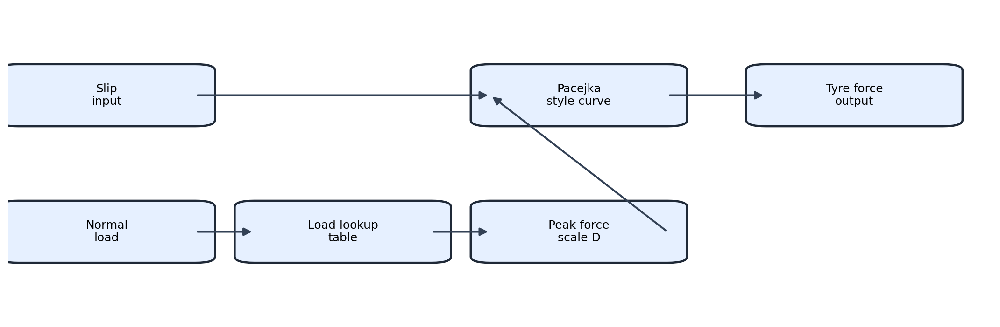
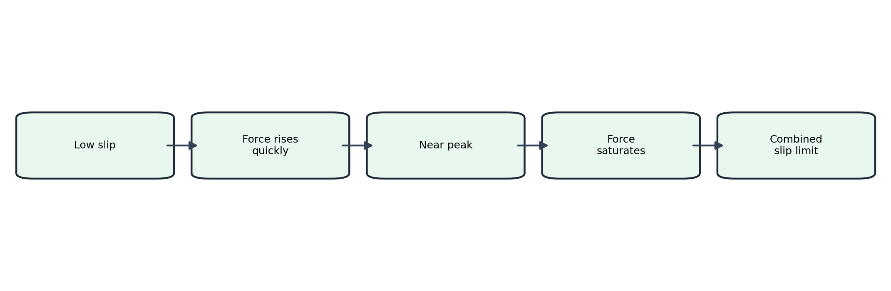
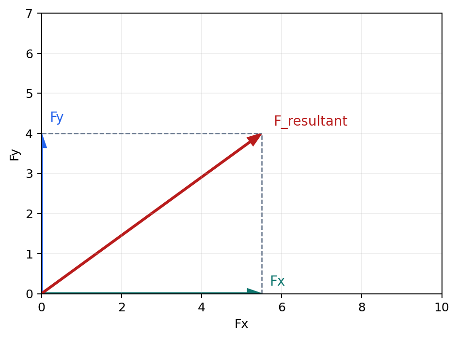
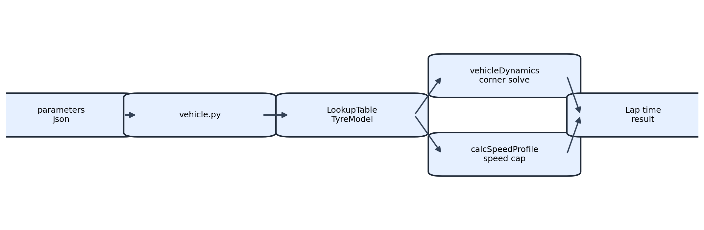

# Tyre Model and Pacejka Flow

## Audience
This note is for developers who need to understand the tyre model at the low level.

## Goal
Explain how the sim turns slip and normal load into tyre force, how the Pacejka style curve is used, and how resultant force is handled in the lap solver.

This page uses static diagram images so it renders in any Markdown viewer.

## Starting Point
The simulator does not use a full transient tyre physics package.
It uses a load-sensitive lookup table model with a Pacejka style force curve.
That gives the sim a practical force model that is stable enough for lap time work.

## What The Model Is Doing
The production path uses `LookupTableTyreModel` from [src/vehicle/Tyres/baseTyre.py](../../src/vehicle/Tyres/baseTyre.py).
The factory function `create_tyre_model` selects that model for the current production path.

The idea is simple.
Normal load changes the available grip, and slip shapes how close the tyre is to that grip limit.

### Force Shape In One View


Text fallback
```
Slip input -> Pacejka style curve -> Tyre force output
Normal load -> Load lookup table -> Peak force scale D -> Pacejka style curve
```

## First Principles View
A tyre contact patch converts vertical load into in-plane force.
That force has two main directions.

- Longitudinal force Fx for drive and braking
- Lateral force Fy for cornering

The tyre does not give infinite grip.
The force rises with slip, then saturates near the limit.
That is why a Pacejka style shape is used.

## Pacejka Style Curve
The core curve is a Magic Formula form.

$$
F(x) = D \sin(C \arctan(Bx - E(Bx - \arctan(Bx))))
$$

Where:
- $x$ is the slip input
- $D$ is the peak force scale from load
- $B$ shapes the initial slope
- $C$ shapes the overall curve
- $E$ shapes the shoulder and peak region

The model uses this form for both lateral and longitudinal channels.
The difference is the slip input and the fitted peak-force data used to build $D$.

### Curve Meaning


Text fallback
```
Low slip -> Force rises quickly -> Near peak -> Force saturates -> Combined slip limit
```

## Resultant Force And Why It Matters
The solver cares about the vector result, not just one force channel.
The real contact patch can generate both Fx and Fy at the same time.
That means the resultant force budget matters.

$$
F_{resultant} = \sqrt{F_x^2 + F_y^2}
$$

### Resultant View


Text fallback
```
Pure Fx + Pure Fy -> Resultant force budget -> Combined slip scaling -> Final tyre force pair
```

The sim first computes pure channel force.
Then it checks if the combined demand exceeds the allowed envelope.
If it does, both forces are scaled down together.
That keeps the result physically sensible.

## Worked Example with Resultant Force

### Real world intuition
Imagine a corner exit where the driver is still turning and starts adding throttle.
The tyre must provide side force and drive force at the same time.

Use an example tyre state with
- pure lateral demand $F_y = 3800$ N
- pure longitudinal demand $F_x = 2600$ N

The combined in-plane demand is

$$
F_{resultant} = \sqrt{3800^2 + 2600^2} \approx 4604 \text{ N}
$$

If this resultant is above available combined grip, the tyre cannot deliver both pure values together.
The real tyre response is a reduced pair of forces.

### How the sim computes the same situation
The combined-force path in [src/vehicle/Tyres/baseTyre.py](../../src/vehicle/Tyres/baseTyre.py) does the following.

1. Compute pure forces from slip inputs.
2. Compute load-based channel peaks `D_lat` and `D_long` from lookup data.
3. Compute total pure demand

$$
F_{total} = \sqrt{F_x^2 + F_y^2}
$$

4. Compute combined cap used in the current model

$$
F_{cap} = 0.9 \cdot \sqrt{D_{lat}^2 + D_{long}^2}
$$

5. If $F_{total} > F_{cap}$, scale both forces by

$$
scale = \frac{F_{cap}}{F_{total}}
$$

and return

$$
F_x' = scale \cdot F_x, \qquad F_y' = scale \cdot F_y
$$

### Numeric worked example in sim terms
Assume the current normal load lookup gives
- $D_{lat} = 4000$ N
- $D_{long} = 3200$ N

Then

$$
F_{cap} = 0.9 \cdot \sqrt{4000^2 + 3200^2} = 0.9 \cdot 5122 \approx 4610 \text{ N}
$$

With the pure demand above, $F_{total} \approx 4604$ N.
This is just under cap, so no scaling occurs and the pure values are returned.

If throttle increases and pure $F_x$ rises to $3200$ N with $F_y = 3800$ N

$$
F_{total} = \sqrt{3800^2 + 3200^2} \approx 4964 \text{ N}
$$

Now $F_{total} > F_{cap}$.
Scale becomes

$$
scale = \frac{4610}{4964} \approx 0.929
$$

Returned forces become
- $F_x' \approx 2973$ N
- $F_y' \approx 3530$ N

This is the key result developers should expect.
The sim preserves direction and relative balance while reducing magnitude to stay inside combined grip.

Reference for the learning report style
- [tools/analysis/compare_tyre_model.py](../../tools/analysis/compare_tyre_model.py)

## How The Simulator Builds The Force
The runtime path is:

1. [src/vehicle/vehicle.py](../../src/vehicle/vehicle.py) loads the vehicle parameters and builds the tyre model.
2. The vehicle layer asks for tyre force using axle-specific normal load.
3. [src/simulator/util/vehicleDynamics.py](../../src/simulator/util/vehicleDynamics.py) uses those forces inside the corner equilibrium solve.
4. [src/simulator/util/calcSpeedProfile.py](../../src/simulator/util/calcSpeedProfile.py) uses the tyre model to estimate speed caps and fallback envelopes.

### Runtime Flow


Text fallback
```
parameters json -> vehicle.py -> LookupTableTyreModel
LookupTableTyreModel -> vehicleDynamics corner solve -> Lap time result
LookupTableTyreModel -> calcSpeedProfile speed cap -> Lap time result
```

## What The Lookup Tables Do
The lookup tables make the tyre load-sensitive.
That is what moves the model away from a fixed mu approximation.

Current behavior:
- Lateral peak force comes from load versus lateral data
- Longitudinal peak force comes from load versus longitudinal data
- The longitudinal slip data is auto-detected as ratio-like or percent-like

Important detail:
- The current dataset handling treats the longitudinal values as ratio-like when the data suggests that format.
- That prevents double scaling.

## How The Simulator Uses The Force
The force model drives two important parts of the sim.

### 1) Corner equilibrium
The solver repeatedly tries a slip angle and a load state.
It asks the tyre model for force and then balances:

- lateral force balance
- yaw moment balance

This is where tyre shape changes corner speed and handling balance.

### 2) Speed profile limits
The tyre model also helps estimate a lateral speed cap.
That cap keeps the search bounded before the solver tries the detailed equilibrium calculation.

## Why This Is Not Just A Curve Fit
This is still a physics model, even though it is compact.
It uses real tyre data as the peak source.
It uses a Pacejka style shape for smooth nonlinear behavior.
It uses combined-slip reduction so the car cannot get full Fx and full Fy at the same time.

## Why Resultant Force Is The Right Mental Model
If a tyre is already spending grip on cornering, it has less left for drive or braking.
That is the core reason the resultant force view matters.
The lap sim is better when that coupling is explicit.

## Validation And Guardrails
Related validation and history live in:

- [docs/MAJOR_CHANGE_LOG.md](../../docs/MAJOR_CHANGE_LOG.md)
- [docs/PARAMETER_ENFORCEMENT_AUDIT_ROADMAP.md](../../docs/PARAMETER_ENFORCEMENT_AUDIT_ROADMAP.md)
- `tools/analysis/compare_tyre_model.py`
- `tests.test_tyre_force_contracts`
- `tests.test_limiting_case_contracts`

Current guardrails include:
- validity domain diagnostics
- out of domain counters
- high load clamp variant for controlled extrapolation
- A/B verification for tyre growth behavior

## Known Limits
This model is not a full transient tyre model.
It does not directly model:

- relaxation length
- temperature evolution
- pressure evolution
- full camber sensitivity
- detailed transient carcass response

That is a tradeoff.
The benefit is a stable model that the lap sim can use directly.

## Developer Checklist
Before changing tyre logic, check:

1. Do we still preserve the load to peak force relationship
2. Do we still preserve the combined-slip envelope
3. Did the factory path stay aligned with the production tyre model
4. Did the verification docs get updated if the envelope changed

## Related Lessons
- [Lessons Index](README.md)
- [How We Added Rollover Constraints and Made It Realistic](../how we added rollover constraints and made it realistic.md)
