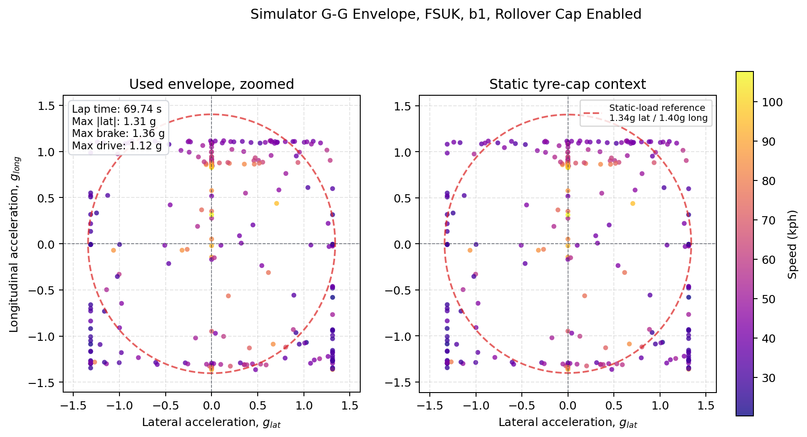

# Vehicle Analysis IRL vs Simulator and GG Envelope

## Read this after
Read [Vehicle Modelling Diagnostics and Trust Checks](Vehicle-Modelling-Diagnostics.md) first.

## Goal
This page gives a fast method to compare real vehicle behavior and simulator behavior.
It uses GG envelope plots as one compact trust and diagnosis view.

## What a GG envelope is
A GG envelope is a scatter or boundary plot of longitudinal and lateral acceleration in g units.
Each point is one sampled vehicle state.

$$
g_{long} = \frac{a_{long}}{9.81}
$$

$$
g_{lat} = \frac{a_{lat}}{9.81}
$$

The convention used in the simulator UI and figure below is lateral g on the x axis and longitudinal g on the y axis.
The outside boundary of the point cloud shows the combined acceleration capability that was actually used.

## Why this helps with IRL vs simulator work
A GG envelope compresses a full lap into one shape.
It is useful for quick checks when real data and simulation disagree.

Use it to answer simple questions.

- Is simulator braking too strong
- Is simulator traction too strong
- Is lateral grip too optimistic
- Is balance changing in the same way as the real car

## How to build IRL and simulator envelopes

### IRL data path
1. Export longitudinal acceleration and lateral acceleration from telemetry.
2. Convert both channels to SI units if needed.
3. Convert to g units using 9.81 m/s^2.
4. Remove obvious spikes and dropouts.
5. Plot $g_{lat}$ on the x axis and $g_{long}$ on the y axis.

### Simulator data path
1. Run a lap simulation with diagnostics.
2. Extract g channels from runtime output or diagnostics outputs.
3. Use the same sign convention and units as IRL data.
4. Plot simulator points and boundary on the same axes.
5. Overlay with IRL for direct comparison.

Relevant code and diagnostics paths

- [src/simulator/simulator.py](../../src/simulator/simulator.py)
- [src/diagnostics/gg_rollover_suite.py](../../src/diagnostics/gg_rollover_suite.py)
- [artifacts/diagnostics/gg_rollover_suite/gg_rollover_channels.csv](../../artifacts/diagnostics/gg_rollover_suite/gg_rollover_channels.csv)
- [artifacts/diagnostics/gg_rollover_suite/gg_rollover_summary.csv](../../artifacts/diagnostics/gg_rollover_suite/gg_rollover_summary.csv)

## GG envelope diagram from simulator run
This diagram is generated from the current simulator diagnostics flow.
The left panel zooms into the used envelope.
The right panel keeps the same points but shows the larger static-load tyre-cap reference.
The dashed ellipse is a reference cap, not a statement that the lap should fill the whole ellipse.

Generation path

- [tools/analysis/generate_vehicle_analysis_figures.py](../../tools/analysis/generate_vehicle_analysis_figures.py) writes the lesson PNG
- [src/diagnostics/gg_rollover_suite.py](../../src/diagnostics/gg_rollover_suite.py) writes diagnostic CSVs and `rollover_ggv.png`
- [src/simulator/util/prettyGraphs/ggvDiagram.py](../../src/simulator/util/prettyGraphs/ggvDiagram.py) contains the plotting helper

Quick regeneration command

- `python tools/analysis/generate_vehicle_analysis_figures.py`
- `python src/diagnostics/gg_rollover_suite.py --track datasets/tracks/FSUK.txt --output-dir artifacts/diagnostics/gg_rollover_suite`

## How to read common mismatch patterns
These are the common mismatch patterns to check when simulator and real GG envelopes do not line up.
Use the direction of the gap to decide which subsystem to inspect first.

### Braking side mismatch
If simulator extends further into negative $g_x$ at similar $|g_y|$, braking authority may be too strong in model assumptions.

### Traction side mismatch
If simulator extends further into positive $g_x$ at low $|g_y|$, powertrain or longitudinal tyre limits may be too high.

### Lateral mismatch
If simulator envelope is wider in $g_y$, lateral tyre limits, load transfer, or aero assumptions may be optimistic.

### Asymmetry clues
Real data often shows left and right asymmetry from setup, camber, surface, and driver effects.
A symmetric simulator envelope can hide this.

## Quick comparison checklist
1. Match units and sign conventions first.
2. Compare boundary trends, not one extreme point.
3. Compare by speed bands for mixed track sections.
4. Confirm tyre, mass, and aero assumptions match test conditions.
5. Tie envelope differences to limiter and fallback diagnostics.

## Limits
GG envelope is a summary view.
It does not identify cause by itself.
Always pair it with speed trace, limiter modes, and solver diagnostics.

## Next lesson
- [Track Geometry and Sampling for Vehicle Dynamics](Track-Geometry-and-Sampling.md)

## Related lessons
- [Vehicle Modelling Diagnostics and Trust Checks](Vehicle-Modelling-Diagnostics.md)
- [Simulator Summary and Core Solver](simulator-summary.md)
- [Vehicle Modelling Capstone](Vehicle-Modelling.md)
 
