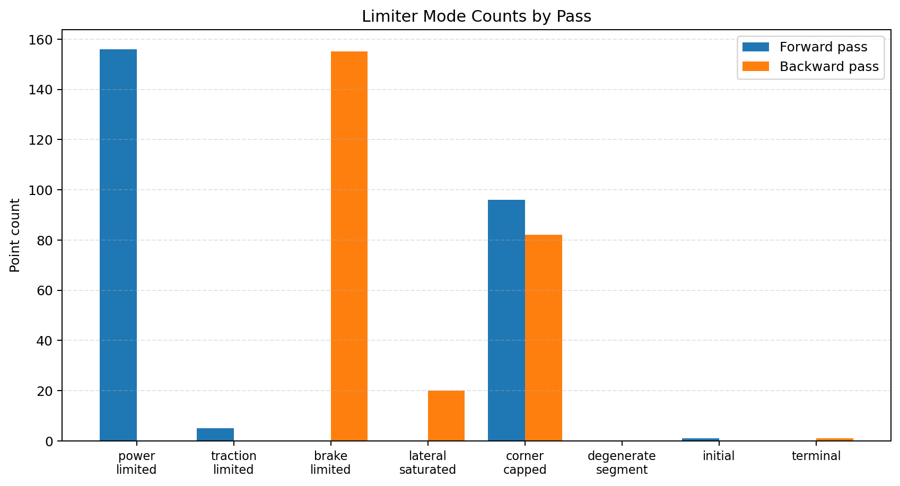
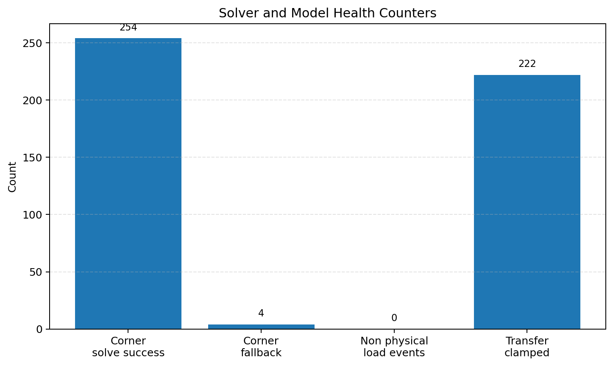
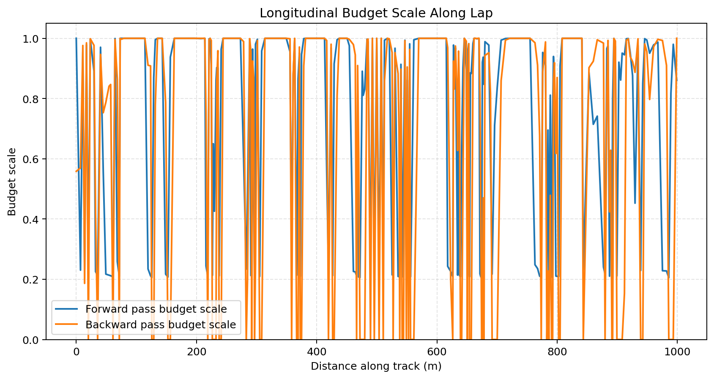
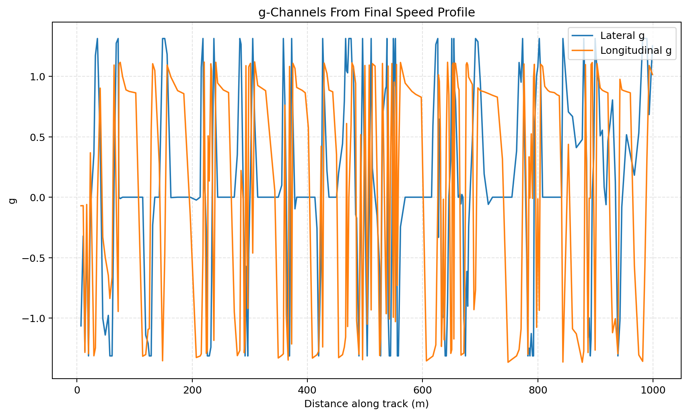

# Vehicle Modelling Diagnostics and Trust Checks

## Read this after
Read these first

- [Vehicle Modelling Capstone](Vehicle-Modelling.md)
- [Simulator Summary and Core Solver](simulator-summary.md)

## Goal
Explain how to decide whether a lap result is credible before using it for setup or design decisions.

## Why this page exists
This page helps you decide if a lap result is credible.
It also helps you decide what to tune next.

## Quick engineer checklist
1. Check what limited speed most often
2. Check corner solver confidence
3. Check friction budget behaviour
4. Check load and clamp health flags
5. Check lap time integration channels

## Figure set for this page
All figures below come from one script run.

Script path [tools/analysis/generate_vehicle_modelling_diagnostics_figures.py](../../tools/analysis/generate_vehicle_modelling_diagnostics_figures.py)

Inputs

- Track = datasets/tracks/FSUK.txt
- Model variant = b1

Outputs

- limiter_mode_counts_from_sim.png
- solver_health_counters_from_sim.png
- longitudinal_budget_scale_from_sim.png
- g_channels_from_sim.png

## 1. What limited this lap
The solver logs limiter mode at each sampled point.
This gives a fast map of where performance is being constrained.

Code path

- [src/simulator/util/calcSpeedProfile.py](../../src/simulator/util/calcSpeedProfile.py) `forward_limiting_mode`
- [src/simulator/util/calcSpeedProfile.py](../../src/simulator/util/calcSpeedProfile.py) `backward_limiting_mode`

Current run example from FSUK with model variant b1

- Forward pass counts from a representative FSUK b1 run. `power_limited=156`, `traction_limited=5`, `corner_capped=96`, `initial=1`
- Backward pass counts from the same run. `brake_limited=155`, `corner_capped=82`, `lateral_saturated=20`, `terminal=1`

How to read this

- More `power_limited` means straight line acceleration is often power constrained
- More `brake_limited` means braking capability is often the bottleneck
- More `corner_capped` means local corner equilibrium is often setting the speed ceiling

## 2. Corner solver confidence
Pass 1 solves corner equilibrium at each point.
When it cannot converge, a constrained fallback speed is used.

Code path

- [src/simulator/util/calcSpeedProfile.py](../../src/simulator/util/calcSpeedProfile.py) `corner_solver_success`
- [src/simulator/util/calcSpeedProfile.py](../../src/simulator/util/calcSpeedProfile.py) `corner_fallback_used`
- [src/simulator/util/calcSpeedProfile.py](../../src/simulator/util/calcSpeedProfile.py) `corner_retry_count`
- [src/simulator/util/calcSpeedProfile.py](../../src/simulator/util/calcSpeedProfile.py) `corner_failure_reason`
- [src/simulator/util/calcSpeedProfile.py](../../src/simulator/util/calcSpeedProfile.py) `corner_tier_failure_reasons`

Current run example

- Corner solver success points in a representative run. `254`
- Corner fallback points in the same run. `4`

Engineering takeaway

- Low fallback count is good
- Rising fallback count means setup or model inputs are pushing the corner solve outside stable regions

## 3. Friction budget coupling in accel and braking
The tyre model shares total force capacity between lateral and longitudinal demand.
As lateral demand rises, less longitudinal budget remains.

Code path

- [src/simulator/util/calcSpeedProfile.py](../../src/simulator/util/calcSpeedProfile.py) `forward_combined_budget_scale`
- [src/simulator/util/calcSpeedProfile.py](../../src/simulator/util/calcSpeedProfile.py) `backward_combined_budget_scale`
- [src/simulator/util/calcSpeedProfile.py](../../src/simulator/util/calcSpeedProfile.py) `_longitudinal_budget_scale_from_lateral_demand`

Core idea

$$
F_{x,available} = F_{x,cap} \cdot \text{budget\_scale}
$$

If `budget_scale` is near 1, longitudinal authority is mostly available.
If `budget_scale` drops, cornering demand is consuming more of the tyre force envelope.

## 4. Why drag helps braking in this model
In backward pass, drag is added as extra deceleration.
This is treated outside the tyre friction circle term.

Code path

- [src/simulator/util/calcSpeedProfile.py](../../src/simulator/util/calcSpeedProfile.py) `a_lat_clamped = min(a_lat, a_limit)`
- [src/simulator/util/calcSpeedProfile.py](../../src/simulator/util/calcSpeedProfile.py) `a_brake = sqrt(a_limit^2 - a_lat_clamped^2)`
- [src/simulator/util/calcSpeedProfile.py](../../src/simulator/util/calcSpeedProfile.py) `a_brake += f_drag / vehicle.params.mass`

Engineering takeaway

- Aero changes can move both top speed and braking-limited regions
- Do not evaluate drag as only a straight line penalty

## 5. Model health flags you should always check
The solver records physical guardrail events.
These tell you when the run is close to model limits.

Code path

- [src/simulator/util/calcSpeedProfile.py](../../src/simulator/util/calcSpeedProfile.py) `normal_load_non_physical_events_total`
- [src/simulator/util/calcSpeedProfile.py](../../src/simulator/util/calcSpeedProfile.py) `normal_load_transfer_clamped_events_total`

A run may show zero non-physical events but still have a high clamp count.
Non-physical events should always be zero.
Clamp counts that approach the total point count are a serious warning, not an informational note.

A clamp count near the total number of track segments means the quasi-static load transfer model is hitting its guardrail on nearly every segment.
Results from such a run may still be directionally useful but the absolute force and speed values should not be trusted without checking whether mass, cog height, or longitudinal acceleration assumptions are realistic.

This same run is shown in the solver health counters figure above.

Engineering takeaway

- Non-zero non-physical load events are a hard red flag. Investigate before using the result.
- Clamp counts above roughly 20 percent of total points are a yellow flag worth investigating.
- Clamp counts approaching the total point count mean the load model is being pushed far outside its valid operating range.

## 6. How lap time is actually integrated
Lap time is integrated segment by segment from the final speed profile.
The same loop also computes longitudinal and lateral g channels.

Code path

- [src/simulator/simulator.py](../../src/simulator/simulator.py) `dt = ds / v_avg`
- [src/simulator/simulator.py](../../src/simulator/simulator.py) `g_long = ((v_curr^2 - v_prev^2) / (2*ds)) / 9.81`
- [src/simulator/simulator.py](../../src/simulator/simulator.py) `g_lat = v_curr^2 * curvature / 9.81`

Engineering takeaway

- Speed trace quality directly controls lap time quality
- Spikes in speed or bad spacing in track points can show up in g channels

Known limit. The g_long formula above has no `g * sin(slope)` term.
The simulator treats every segment as flat.
The `elevation_angle` field is computed from track coordinates but is not used in the integration.
Lap time on a track with significant elevation change will be biased.
Elevation propagation is on the roadmap.

Representative channel ranges will vary with setup and track.
The main check is whether longitudinal and lateral g magnitudes are physically plausible for the car class and track.
For FSAE, longitudinal g beyond about 2 g or lateral g beyond about 3 g is a signal to inspect model inputs.

## 7. Telemetry sign conventions
The simulator publishes its channels with these conventions. Read them before interpreting any plot.

**Longitudinal g (`g_long`).** Positive when the car is accelerating along the track direction. Negative when braking. Magnitudes under braking commonly exceed magnitudes under acceleration because braking is tyre-limited while acceleration is power-limited.

**Lateral g (`g_lat`).** Sign follows track curvature. Positive in a left-hand turn, negative in a right-hand turn. Zero on a straight.

**Curvature (`curvature_1pm`).** Signed by the same rule as lateral g. Positive for left, negative for right.

**Speed (`speeds_kmh`).** Always non-negative. Sign carries no information about direction along the track.

**Mu utilization (`mu_util`).** Magnitude of combined lateral and longitudinal g divided by `base_mu`. A value of 1.0 means the car is at the simple tyre grip ceiling. Values slightly above 1.0 are physically possible because the tyre peak mu at low normal load can exceed `base_mu`.

**Front axle load (`normal_load_front_n`) and rear axle load (`normal_load_rear_n`).** Total vertical load in Newtons, always non-negative. Front rises under braking and under high speed when aero centre of pressure is forward. Rear rises under acceleration and at high speed when aero centre of pressure is rearward.

These conventions are also surfaced in the channel sidebar tooltips of the Base Simulator tab.

## Suggested tuning workflow
1. Run a baseline lap and store diagnostics
2. Read limiter mode counts to identify dominant bottleneck
3. Check corner fallback and health flags before trusting small lap deltas
4. Make one subsystem change
5. Re-run and compare limiter mix plus lap time together

## Next lesson
- [Vehicle Analysis IRL vs Simulator and GG Envelope](Vehicle-Analysis-IRL-vs-Simulator.md)

## Related lessons
- [Vehicle Modelling Capstone](Vehicle-Modelling.md)
- [Simulator Summary and Core Solver](simulator-summary.md)
- [Vehicle Analysis IRL vs Simulator and GG Envelope](Vehicle-Analysis-IRL-vs-Simulator.md)
- [Track Geometry and Sampling for Vehicle Dynamics](Track-Geometry-and-Sampling.md)
- [Aerodynamics Model Intro](Aero-Model.md)
- [Tyre Model Deep Dive](Tyre-Model-Deep-Dive.md)
- [Lessons Index](README.md)
