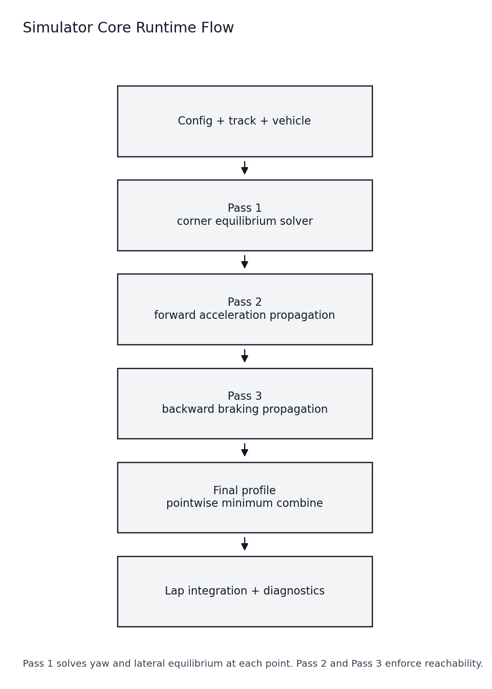
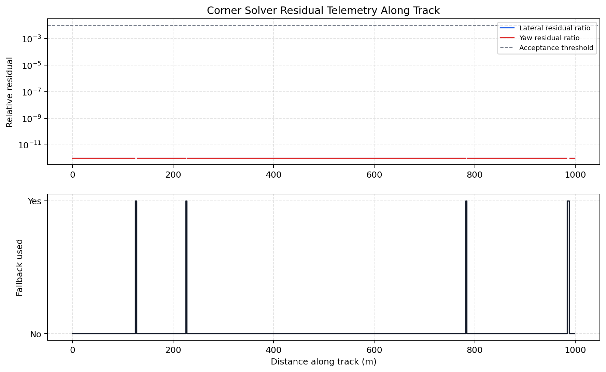
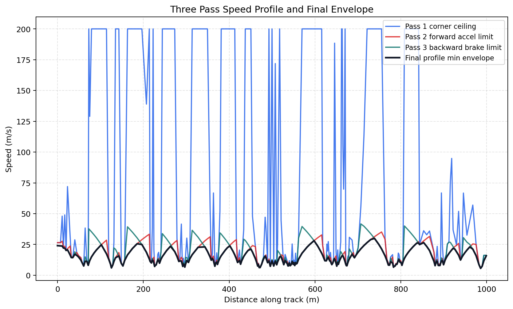

# Simulator Summary and Core Solver

## Read this after
Read these first

- [Simulator Basics](Simulator-Basics.md)
- [Tyre Model Intro](Tyre-Model.md)
- [Powertrain Model and Wheel Force Flow](Powertrain-Model.md)
- [Aerodynamics Model Intro](Aero-Model.md)
- [Vehicle Modelling Capstone](Vehicle-Modelling.md)

## Goal
This page gives one compact view of how the simulator runs.
It also explains the core corner solver from both high level and low level math.

## Equation source for this page
Primary derivation reference

- [Quasi static steady state lap time simulation draft](../Quasi_static_Steady_State_Lap_Time_Simulation_Draft_1%20(1).pdf)

This lesson keeps the same core equations and variable meanings from that draft.

## High-level simulator run summary
The runtime is a chained solve.
Each stage carries physical limits into the next stage.

1. Load config, track, and vehicle models
2. Pass 1 finds corner-feasible speed at each point
3. Pass 2 enforces forward acceleration reachability
4. Pass 3 enforces backward braking reachability
5. Final speed is the pointwise minimum of forward and backward constraints
6. Lap time and g channels are integrated from final speed profile

Script path [tools/analysis/generate_simulator_summary_figures.py](../../tools/analysis/generate_simulator_summary_figures.py)

Current run summary

- Track = datasets/tracks/FSUK.txt
- Model variant = b1
- Point count = 258
- Lap time = 65.353 s

## How this captures forces from prior lessons
This run combines all force pathways discussed in earlier lessons.

- Tyre model provides lateral and longitudinal force capacity
- Powertrain requests traction force at the tyre contact patch
- Drag subtracts from net longitudinal force
- Downforce and load transfer modify front and rear normal loads
- Combined force budgeting reduces longitudinal authority when lateral demand is high

Core implementation path

- [src/simulator/util/vehicleDynamics.py](../../src/simulator/util/vehicleDynamics.py)
- [src/simulator/util/calcSpeedProfile.py](../../src/simulator/util/calcSpeedProfile.py)
- [src/simulator/simulator.py](../../src/simulator/simulator.py)

## Core corner solver high-level view
At one track point, the corner solver asks

- what speed can satisfy lateral force balance
- what steer and sideslip satisfy yaw moment balance
- whether that solution is physically feasible and stable

This is repeated while searching for the highest feasible speed at that point.

In draft wording

- Treat speed $v$ as the outer-loop independent variable
- For each candidate $v$, solve $\delta$ and $\beta$ in the inner loop

## Core corner solver low-level math
This section uses the same governing equations as the internal equation audit.

Unknowns at each candidate speed

- Steering angle $\delta$
- Sideslip angle $\beta$

Slip-angle relations

$$
\alpha_f = \delta - \beta - aK
$$

$$
\alpha_r = -\beta + bK
$$

Force and moment equilibrium

$$
m v^2 K = F_{y,f} + F_{y,r}
$$

$$
aF_{y,f} = bF_{y,r}
$$

Rollover speed cap used in corner search

$$
v_{roll} = \sqrt{\frac{t}{2h} g R},\quad R = \frac{1}{|K|}
$$

## Draft equation mapping table
This table maps the draft equations to production code variables and runtime paths.

| Draft equation | Code-side variables | Units | Runtime path |
| --- | --- | --- | --- |
| $\alpha_f = \delta - \beta - aK$ | `alpha_f = delta - beta - (a * K)` | rad | [src/simulator/util/vehicleDynamics.py](../../src/simulator/util/vehicleDynamics.py) in `find_vehicle_state_at_point` |
| $\alpha_r = -\beta + bK$ | `alpha_r = -beta + (b * K)` | rad | [src/simulator/util/vehicleDynamics.py](../../src/simulator/util/vehicleDynamics.py) in `find_vehicle_state_at_point` |
| $m v^2 K = F_{y,f} + F_{y,r}$ | `res_lat = (m * v_mid**2 * K) - (Fy_f + Fy_r)` | N balance residual | [src/simulator/util/vehicleDynamics.py](../../src/simulator/util/vehicleDynamics.py) in `find_vehicle_state_at_point` |
| $aF_{y,f} = bF_{y,r}$ | `res_yaw = (a * Fy_f) - (b * Fy_r)` | N m balance residual | [src/simulator/util/vehicleDynamics.py](../../src/simulator/util/vehicleDynamics.py) in `find_vehicle_state_at_point` |
| $v_{roll} = \sqrt{\frac{t}{2h} g R}$ | `v_rollover = sqrt((t / (2 * h)) * g * R)` | m/s | [src/simulator/util/vehicleDynamics.py](../../src/simulator/util/vehicleDynamics.py) and [src/simulator/util/calcSpeedProfile.py](../../src/simulator/util/calcSpeedProfile.py) cap composition |
| $v_{i,pred}^2 = v_{i-1}^2 + 2a_{x,i}\Delta s$ | `v_pred_squared = v_prev**2 + 2 * a_lon * ds` | m^2/s^2 | [src/simulator/util/calcSpeedProfile.py](../../src/simulator/util/calcSpeedProfile.py) in `forward_pass` |
| $v_{i,brake}^2 = v_{i+1}^2 + 2a_{brake,i}\Delta s$ | `v_brake_squared = v_next**2 + 2 * a_brake * ds` | m^2/s^2 | [src/simulator/util/calcSpeedProfile.py](../../src/simulator/util/calcSpeedProfile.py) in `backward_pass` |
| $dt = ds / v_{avg}$ | `dt = ds / v_avg` | s | [src/simulator/simulator.py](../../src/simulator/simulator.py) in lap-time integration loop |

## How optimization is done in code
The corner solver uses a two-layer search.

1. Build a physical upper bound for speed from caps
2. Outer loop uses bisection on speed between zero and that bound
3. Inner loop uses nonlinear root solve on $\delta$ and $\beta$ for each speed test
4. Solution is accepted only if residual checks and state bounds pass
5. If not feasible, speed upper bound is reduced
6. Best feasible speed is retained

Important accept and fallback behavior

- Initial guess is warm-started from the previous successful point when available
- Residual acceptance uses scale-aware thresholds
- Steering and sideslip sanity bounds are enforced
- If no feasible equilibrium is found at a point, constrained fallback speed is used

Production extension over the draft

- Draft assumes static axle normal loads in the point solve
- Production path uses front and rear per-tyre load estimates from the load model
- Production path also composes extra speed caps and retry tiers before fallback

Code path

- [src/simulator/util/vehicleDynamics.py](../../src/simulator/util/vehicleDynamics.py) `find_vehicle_state_at_point`
- [src/simulator/util/calcSpeedProfile.py](../../src/simulator/util/calcSpeedProfile.py) `optimise_speed_at_points`

## Residuals and fallback telemetry from current run
The plot below shows relative residual channels and where fallback was used.

Current run diagnostics

- Corner fallback count = 4 points
- Relative lateral residual p95 = 6.62e-16
- Relative yaw residual p95 = 3.34e-16

Interpretation

- Very low residuals on solved points show tight equilibrium satisfaction
- Fallback points are where the solver could not find a feasible equilibrium state

## Final profile combine and lap integration
The final profile is not from one pass alone.
It is the lower envelope after forward and backward constraints are applied.

Lap integration channels are then computed from this final speed trace.

## Practical trust checklist
1. Check corner fallback count before trusting small lap deltas
2. Check residual telemetry for drift or spikes
3. Check limiter mode mix in diagnostics
4. Check model health flags for non-physical load or heavy clamping

## Related lessons
- [Track Geometry and Sampling for Vehicle Dynamics](Track-Geometry-and-Sampling.md)
- [Vehicle Modelling Capstone](Vehicle-Modelling.md)
- [Vehicle Modelling Diagnostics and Trust Checks](Vehicle-Modelling-Diagnostics.md)
- [Lessons Index](README.md)
